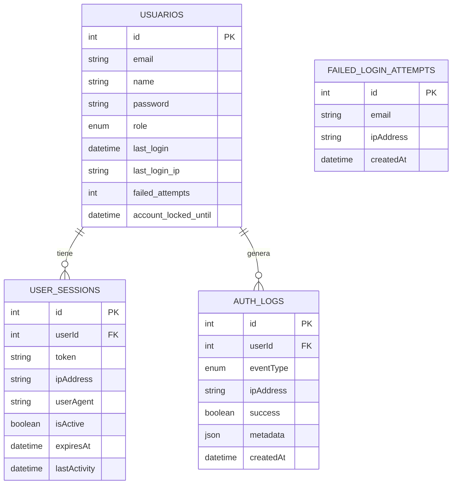
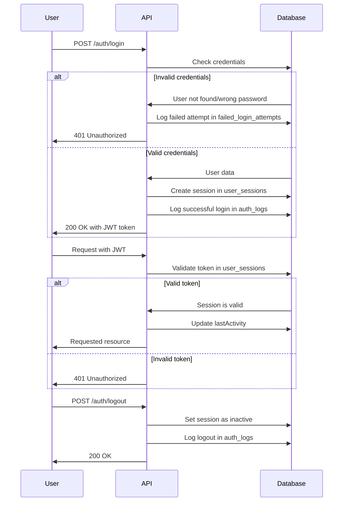

# 🛡️ Actualización del Sistema de Autenticación (Junio 2025)

Este documento es un complemento de la documentación principal de la API y detalla las mejoras implementadas en el sistema de autenticación en junio de 2025.

## 📋 Tabla de Contenidos

1. [Estructura de Tablas Actualizada](#estructura-de-tablas-actualizada)
2. [Nuevos Endpoints](#nuevos-endpoints)
3. [Gestión de Sesiones](#gestión-de-sesiones)
4. [Logs de Autenticación](#logs-de-autenticación)
5. [Protección contra Ataques](#protección-contra-ataques)
6. [Integración con Frontend](#integración-con-frontend)

---

## Estructura de Tablas Actualizada

Se ha actualizado la nomenclatura de las tablas relacionadas con seguridad, pasando de nombres en singular a plural:

| Tabla Antigua          | Tabla Nueva             | Descripción                           |
| ---------------------- | ----------------------- | ------------------------------------- |
| `auth_log`             | `auth_logs`             | Registros de eventos de autenticación |
| `user_session`         | `user_sessions`         | Sesiones activas de usuarios          |
| `failed_login_attempt` | `failed_login_attempts` | Intentos fallidos de autenticación    |

### Diagrama de Entidad-Relación



## Nuevos Endpoints

Se han añadido nuevos endpoints para mejorar la gestión de la autenticación:

### Logout (Cerrar Sesión)

```
POST /api/auth/logout
```

**Headers:**

```
Authorization: Bearer <token>
```

**Response (200 OK):**

```json
{
  "message": "Logged out successfully",
  "sessionsRevoked": 1
}
```

### Listar Sesiones Activas

```
GET /api/auth/sessions
```

**Headers:**

```
Authorization: Bearer <token>
```

**Response (200 OK):**

```json
[
  {
    "id": 1,
    "ipAddress": "192.168.1.100",
    "userAgent": "Mozilla/5.0...",
    "isActive": true,
    "createdAt": "2025-06-10T15:45:00Z",
    "lastActivity": "2025-06-12T14:32:00Z",
    "expiresAt": "2025-06-15T15:45:00Z",
    "current": true
  },
  {
    "id": 2,
    "ipAddress": "192.168.1.101",
    "userAgent": "Mozilla/5.0...",
    "isActive": true,
    "createdAt": "2025-06-11T09:20:00Z",
    "lastActivity": "2025-06-12T10:15:00Z",
    "expiresAt": "2025-06-14T09:20:00Z",
    "current": false
  }
]
```

### Revocar una Sesión Específica

```
DELETE /api/auth/sessions/:sessionId
```

**Headers:**

```
Authorization: Bearer <token>
```

**Response (200 OK):**

```json
{
  "message": "Session revoked successfully"
}
```

### Ver Registros de Autenticación

```
GET /api/auth/logs
```

**Headers:**

```
Authorization: Bearer <token>
```

**Query Parameters:**

- `limit` (opcional): Número de registros a devolver
- `page` (opcional): Página de resultados
- `type` (opcional): Filtrar por tipo de evento

**Response (200 OK):**

```json
{
  "logs": [
    {
      "id": 1,
      "eventType": "login",
      "ipAddress": "192.168.1.100",
      "userAgent": "Mozilla/5.0...",
      "success": true,
      "createdAt": "2025-06-12T14:32:00Z"
    }
  ],
  "pagination": {
    "total": 45,
    "page": 1,
    "limit": 20,
    "pages": 3
  }
}
```

### Obtener Informe de Seguridad

```
GET /api/auth/security/report
```

**Headers:**

```
Authorization: Bearer <token>
```

**Response (200 OK):**

```json
{
  "period": "Last 24 hours",
  "totalFailedAttempts": 5,
  "currentlyBlockedAccounts": 0,
  "uniqueTargetedEmails": 3,
  "topTargetedEmails": [
    {
      "email": "admin@example.com",
      "attempts": 3
    }
  ],
  "topAttackingIps": [
    {
      "ip": "192.168.1.200",
      "attempts": 3
    }
  ],
  "generatedAt": "2025-06-12T15:00:00Z"
}
```

## Gestión de Sesiones

El sistema ahora permite múltiples sesiones activas por usuario:

- Cada inicio de sesión crea un registro en `user_sessions`
- Los usuarios pueden ver todas sus sesiones activas
- Los usuarios pueden revocar sesiones individuales
- Las sesiones inactivas por más de 7 días se desactivan automáticamente
- Se registra información detallada como IP, navegador, dispositivo

### Flujo de Autenticación



## Logs de Autenticación

Se registran los siguientes tipos de eventos:

| Tipo de Evento        | Descripción                                       |
| --------------------- | ------------------------------------------------- |
| `login`               | Inicio de sesión exitoso                          |
| `logout`              | Cierre de sesión                                  |
| `failed_login`        | Intento fallido de inicio de sesión               |
| `password_changed`    | Cambio de contraseña exitoso                      |
| `account_locked`      | Cuenta bloqueada por demasiados intentos fallidos |
| `suspicious_activity` | Actividad sospechosa detectada                    |

Cada registro incluye:

- Usuario afectado (si aplica)
- Dirección IP
- User Agent (navegador/dispositivo)
- Resultado de la operación
- Timestamp
- Metadatos adicionales según el evento

## Protección contra Ataques

El sistema implementa varias capas de protección:

1. **Rate Limiting**:

   - 5 intentos por minuto en endpoints de autenticación
   - 60 intentos por minuto en endpoints generales

2. **Bloqueo de Cuentas**:

   - Bloqueo temporal después de 5 intentos fallidos consecutivos
   - El tiempo de bloqueo aumenta progresivamente
   - Notificación al usuario sobre intentos sospechosos

3. **Detección de Ubicación**:

   - Registro del país/ciudad del acceso
   - Alertas para inicios de sesión desde ubicaciones inusuales

4. **Notificaciones de Seguridad**:
   - Alertas para actividades sospechosas
   - Registros detallados para análisis forense

## Integración con Frontend

### Interceptor de Axios para Manejo de Autenticación

```typescript
// auth-interceptor.ts
import axios from 'axios';
import { showNotification } from './notifications';

// Crear instancia de axios con configuración base
const api = axios.create({
  baseURL: 'https://api-url.com/api',
  timeout: 10000,
  headers: {
    'Content-Type': 'application/json',
  },
});

// Interceptor para añadir token de autenticación
api.interceptors.request.use(
  config => {
    const token = localStorage.getItem('token');
    if (token) {
      config.headers['Authorization'] = `Bearer ${token}`;
    }
    return config;
  },
  error => Promise.reject(error),
);

// Interceptor para manejar errores de autenticación
api.interceptors.response.use(
  response => response,
  error => {
    // Manejar error de autenticación
    if (error.response?.status === 401) {
      localStorage.removeItem('token');
      showNotification('Sesión expirada. Por favor inicie sesión nuevamente.');
      window.location.href = '/login';
    }

    // Manejar error de permisos
    if (error.response?.status === 403) {
      showNotification('No tiene permisos para realizar esta acción', 'error');
    }

    // Manejar límite de rate
    if (error.response?.status === 429) {
      showNotification(
        'Demasiadas solicitudes. Por favor intente más tarde.',
        'warning',
      );
    }

    return Promise.reject(error);
  },
);

export default api;
```

### Componente para Gestionar Sesiones Activas

```tsx
// ActiveSessions.tsx
import React, { useEffect, useState } from 'react';
import api from '../utils/api-client';

interface Session {
  id: number;
  ipAddress: string;
  userAgent: string;
  createdAt: string;
  lastActivity: string;
  current: boolean;
}

const ActiveSessions: React.FC = () => {
  const [sessions, setSessions] = useState<Session[]>([]);
  const [loading, setLoading] = useState(true);
  const [error, setError] = useState<string | null>(null);

  useEffect(() => {
    loadSessions();
  }, []);

  const loadSessions = async () => {
    try {
      setLoading(true);
      const response = await api.get('/auth/sessions');
      setSessions(response.data);
      setError(null);
    } catch (err) {
      setError('Error al cargar sesiones');
      console.error(err);
    } finally {
      setLoading(false);
    }
  };

  const revokeSession = async (id: number) => {
    try {
      await api.delete(`/auth/sessions/${id}`);
      // Recargar la lista de sesiones
      await loadSessions();
    } catch (err) {
      setError('Error al revocar la sesión');
      console.error(err);
    }
  };

  const formatDate = (dateString: string) => {
    return new Date(dateString).toLocaleString();
  };

  if (loading) return <div>Cargando sesiones...</div>;
  if (error) return <div className="error">{error}</div>;

  return (
    <div className="sessions-container">
      <h2>Sesiones Activas</h2>

      {sessions.length === 0 ? (
        <p>No hay sesiones activas</p>
      ) : (
        <table className="sessions-table">
          <thead>
            <tr>
              <th>Dispositivo</th>
              <th>Dirección IP</th>
              <th>Iniciada el</th>
              <th>Última actividad</th>
              <th>Acciones</th>
            </tr>
          </thead>
          <tbody>
            {sessions.map(session => (
              <tr
                key={session.id}
                className={session.current ? 'current-session' : ''}
              >
                <td>
                  {session.userAgent.substring(0, 50)}...
                  {session.current && <span className="badge">Actual</span>}
                </td>
                <td>{session.ipAddress}</td>
                <td>{formatDate(session.createdAt)}</td>
                <td>{formatDate(session.lastActivity)}</td>
                <td>
                  {session.current ? (
                    <span>Sesión actual</span>
                  ) : (
                    <button
                      onClick={() => revokeSession(session.id)}
                      className="btn-revoke"
                    >
                      Cerrar sesión
                    </button>
                  )}
                </td>
              </tr>
            ))}
          </tbody>
        </table>
      )}
    </div>
  );
};

export default ActiveSessions;
```

---

Para más información sobre la integración con frontend, consulte la guía completa: [`FRONTEND_AUTH_GUIDE_2025.md`](../development/FRONTEND_AUTH_GUIDE_2025.md).

---

**Última actualización:** Junio 12, 2025
