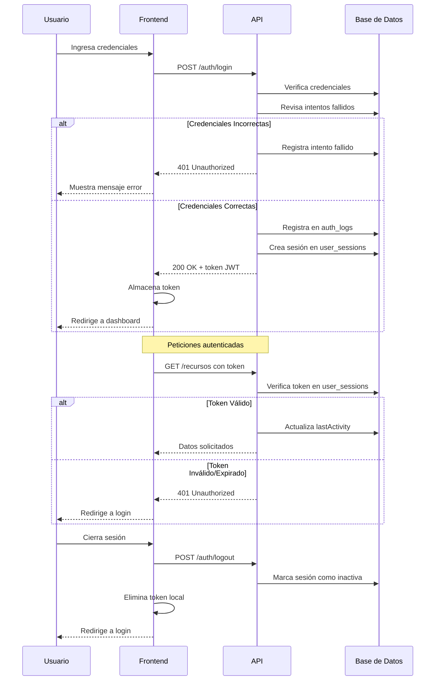

# Guía de Autenticación Frontend para API INGEOCIMYC (2025)

## 📋 Índice

- [Descripción General del Sistema](#descripción-general-del-sistema)
- [Novedades en la Versión 2025](#novedades-en-la-versión-2025)
- [Estructura de Tablas de Seguridad](#estructura-de-tablas-de-seguridad)
- [Flujo de Autenticación Completo](#flujo-de-autenticación-completo)
- [Endpoints de Autenticación](#endpoints-de-autenticación)
- [Gestión de Tokens](#gestión-de-tokens)
- [Gestión de Sesiones](#gestión-de-sesiones)
- [Sistema de Roles](#sistema-de-roles)
- [Mejores Prácticas](#mejores-prácticas)
- [Ejemplos de Código](#ejemplos-de-código)
- [Preguntas Frecuentes](#preguntas-frecuentes)

---

## Descripción General del Sistema

La API de INGEOCIMYC implementa un sistema de autenticación robusto basado en:

- **JWT (JSON Web Tokens)**: Para autenticación sin estado
- **Almacenamiento de sesiones**: Persistencia y control de sesiones activas
- **Monitoreo de actividad**: Registro de eventos de autenticación
- **Seguridad contra ataques**: Protección contra intentos de fuerza bruta
- **Control de acceso basado en roles**: Admin, Lab y Client

## Novedades en la Versión 2025

La actualización 2025 incluye mejoras significativas en el sistema de autenticación:

- **Tablas pluralizadas**: Todas las tablas de seguridad ahora usan nombres en plural
- **Sesiones múltiples**: Ahora se admiten múltiples sesiones por usuario
- **Informes de seguridad**: Nuevos endpoints para monitoreo
- **Control de sesiones**: Interfaz para visualizar y revocar sesiones
- **Bloqueo inteligente**: Sistema adaptativo contra ataques de fuerza bruta

## Estructura de Tablas de Seguridad

El sistema utiliza tres tablas principales para el manejo de la seguridad:

### Tabla `auth_logs`

Registra todos los eventos relacionados con autenticación:

| Campo     | Tipo      | Descripción                                        |
| --------- | --------- | -------------------------------------------------- |
| id        | INT       | Identificador único                                |
| userId    | INT       | ID del usuario relacionado                         |
| eventType | ENUM      | Tipo de evento (login, logout, failed_login, etc.) |
| ipAddress | VARCHAR   | Dirección IP desde donde se realizó la acción      |
| userAgent | TEXT      | Navegador/dispositivo utilizado                    |
| success   | BOOLEAN   | Si la acción fue exitosa                           |
| createdAt | TIMESTAMP | Momento en que ocurrió el evento                   |

### Tabla `user_sessions`

Almacena información sobre las sesiones activas:

| Campo        | Tipo      | Descripción                      |
| ------------ | --------- | -------------------------------- |
| id           | INT       | Identificador único de la sesión |
| userId       | INT       | ID del usuario                   |
| token        | VARCHAR   | Hash del token JWT               |
| ipAddress    | VARCHAR   | Dirección IP de la sesión        |
| userAgent    | TEXT      | Navegador/dispositivo            |
| isActive     | BOOLEAN   | Si la sesión está activa         |
| expiresAt    | TIMESTAMP | Cuándo expira la sesión          |
| lastActivity | TIMESTAMP | Último uso de la sesión          |
| createdAt    | TIMESTAMP | Cuándo se creó la sesión         |

### Tabla `failed_login_attempts`

Registra intentos fallidos de inicio de sesión:

| Campo     | Tipo      | Descripción                      |
| --------- | --------- | -------------------------------- |
| id        | INT       | Identificador único              |
| email     | VARCHAR   | Email que intentó iniciar sesión |
| ipAddress | VARCHAR   | Dirección IP de origen           |
| createdAt | TIMESTAMP | Cuándo ocurrió el intento        |

## Flujo de Autenticación Completo



## Endpoints de Autenticación

### Login

```
POST /api/auth/login
```

**Request:**

```json
{
  "email": "usuario@ejemplo.com",
  "password": "contraseña_segura",
  "rememberMe": true
}
```

**Response (200 OK):**

```json
{
  "accessToken": "eyJhbGciOiJIUzI1NiIsInR5cCI6IkpXVCJ9...",
  "user": {
    "id": 1,
    "name": "Nombre Usuario",
    "email": "usuario@ejemplo.com",
    "role": "admin"
  }
}
```

### Logout

```
POST /api/auth/logout
```

**Headers:**

```
Authorization: Bearer <token>
```

**Response (200 OK):**

```json
{
  "message": "Logged out successfully",
  "sessionsRevoked": 1
}
```

### Perfil de Usuario

```
GET /api/auth/profile
```

**Headers:**

```
Authorization: Bearer <token>
```

**Response (200 OK):**

```json
{
  "id": 1,
  "name": "Nombre Usuario",
  "email": "usuario@ejemplo.com",
  "role": "admin",
  "created_at": "2024-05-10T15:30:00Z"
}
```

### Sesiones Activas

```
GET /api/auth/sessions
```

**Headers:**

```
Authorization: Bearer <token>
```

**Response (200 OK):**

```json
[
  {
    "id": 123,
    "ipAddress": "192.168.1.100",
    "userAgent": "Mozilla/5.0...",
    "isActive": true,
    "createdAt": "2025-06-10T15:45:00Z",
    "lastActivity": "2025-06-12T14:32:00Z",
    "expiresAt": "2025-06-13T15:45:00Z",
    "current": true
  },
  {
    "id": 124,
    "ipAddress": "192.168.1.101",
    "userAgent": "Mozilla/5.0...",
    "isActive": true,
    "createdAt": "2025-06-11T09:20:00Z",
    "lastActivity": "2025-06-12T10:15:00Z",
    "expiresAt": "2025-06-13T09:20:00Z",
    "current": false
  }
]
```

### Revocar Sesión

```
DELETE /api/auth/sessions/:sessionId
```

**Headers:**

```
Authorization: Bearer <token>
```

**Response (200 OK):**

```json
{
  "message": "Session revoked successfully"
}
```

### Cambiar Contraseña

```
PATCH /api/auth/change-password
```

**Headers:**

```
Authorization: Bearer <token>
```

**Request:**

```json
{
  "currentPassword": "contraseña_actual",
  "newPassword": "nueva_contraseña",
  "confirmPassword": "nueva_contraseña"
}
```

**Response (200 OK):**

```json
{
  "message": "Password changed successfully"
}
```

## Gestión de Tokens

### Estructura del Token JWT

El token JWT contiene la siguiente información en su payload:

```json
{
  "sub": "1", // ID del usuario
  "email": "usuario@ejemplo.com",
  "name": "Usuario",
  "role": "admin",
  "iat": 1623456789, // Fecha de emisión
  "exp": 1623543189 // Fecha de expiración (24 horas después)
}
```

### Almacenamiento Recomendado

Para aplicaciones web, recomendamos almacenar el token en:

1. **Primera opción**: `localStorage` para aplicaciones SPA sin requisitos de seguridad extremos
2. **Segunda opción**: `HttpOnly Cookies` para mayor seguridad (requiere configuración en backend)

### Verificación del Token

El token debe enviarse en todas las peticiones autenticadas:

```js
// Ejemplo con fetch
fetch('https://api-url.com/api/recursos', {
  headers: {
    Authorization: `Bearer ${localStorage.getItem('token')}`,
  },
});
```

## Gestión de Sesiones

La API ahora permite gestionar múltiples sesiones activas:

- Cada dispositivo/navegador desde donde se inicia sesión crea una sesión independiente
- El usuario puede ver todas sus sesiones activas
- El usuario puede cerrar sesiones específicas (por ejemplo, si detecta una sesión sospechosa)
- El sistema puede limitar el número máximo de sesiones simultáneas (configurable)

### Implementación Recomendada

```typescript
// Ejemplo de componente para mostrar sesiones activas
async function loadActiveSessions() {
  try {
    const response = await api.get('/auth/sessions');
    setSessions(response.data);
  } catch (error) {
    console.error('Error loading sessions:', error);
  }
}

async function revokeSession(sessionId: number) {
  try {
    await api.delete(`/auth/sessions/${sessionId}`);
    // Recargar sesiones
    loadActiveSessions();
    showNotification('Sesión cerrada con éxito');
  } catch (error) {
    console.error('Error revoking session:', error);
  }
}
```

## Sistema de Roles

La API implementa 3 roles principales:

1. **admin**: Acceso total al sistema
2. **lab**: Acceso a módulos de laboratorio y procesamiento
3. **client**: Acceso limitado a sus propios proyectos y solicitudes

### Verificación de Roles en Frontend

```typescript
// Ejemplo de componente de ruta protegida por rol
function ProtectedRoute({ children, requiredRoles }) {
  const { user, isAuthenticated } = useAuth();

  if (!isAuthenticated) {
    return <Navigate to="/login" />;
  }

  if (!requiredRoles.includes(user.role)) {
    return <Navigate to="/unauthorized" />;
  }

  return children;
}

// Uso
<ProtectedRoute requiredRoles={['admin', 'lab']}>
  <AdminDashboard />
</ProtectedRoute>
```

## Mejores Prácticas

### 1. Manejo de Errores de Autenticación

```typescript
// Interceptor de errores para axios
api.interceptors.response.use(
  response => response,
  error => {
    if (error.response?.status === 401) {
      // Token expirado o inválido
      authStore.logout();
      router.push('/login?expired=true');
    }

    if (error.response?.status === 403) {
      // Permiso denegado
      router.push('/unauthorized');
    }

    return Promise.reject(error);
  },
);
```

### 2. Prevenir Pérdida de Datos

```typescript
// Guardar formularios en localStorage antes de enviar
function saveFormDraft(formData) {
  localStorage.setItem('form_draft', JSON.stringify(formData));
}

// Cargar borrador al iniciar
function loadFormDraft() {
  const draft = localStorage.getItem('form_draft');
  return draft ? JSON.parse(draft) : null;
}

// Limpiar borrador al enviar exitosamente
function clearFormDraft() {
  localStorage.removeItem('form_draft');
}
```

### 3. Validación de Tokens al Inicio

```typescript
// En el componente principal o hook de autenticación
async function validateTokenOnStartup() {
  const token = localStorage.getItem('token');

  if (!token) {
    return false;
  }

  try {
    // Verificar si el token aún es válido
    await api.get('/auth/profile');
    return true;
  } catch (error) {
    // Token inválido o expirado
    localStorage.removeItem('token');
    return false;
  }
}
```

## Ejemplos de Código

### Hook de Autenticación Completo

```typescript
// useAuth.ts
import { useState, useEffect, createContext, useContext } from 'react';
import api from './api';

interface User {
  id: number;
  name: string;
  email: string;
  role: 'admin' | 'lab' | 'client';
}

interface AuthState {
  user: User | null;
  isAuthenticated: boolean;
  loading: boolean;
}

interface AuthContextType extends AuthState {
  login: (email: string, password: string, rememberMe?: boolean) => Promise<void>;
  logout: () => void;
  checkAuth: () => Promise<boolean>;
}

const AuthContext = createContext<AuthContextType | null>(null);

export function AuthProvider({ children }) {
  const [state, setState] = useState<AuthState>({
    user: null,
    isAuthenticated: false,
    loading: true
  });

  // Verificar autenticación al cargar
  useEffect(() => {
    checkAuth();
  }, []);

  const checkAuth = async () => {
    setState(prev => ({ ...prev, loading: true }));

    const token = localStorage.getItem('token');
    if (!token) {
      setState({ user: null, isAuthenticated: false, loading: false });
      return false;
    }

    try {
      const response = await api.get('/auth/profile');
      setState({
        user: response.data,
        isAuthenticated: true,
        loading: false
      });
      return true;
    } catch (error) {
      localStorage.removeItem('token');
      setState({
        user: null,
        isAuthenticated: false,
        loading: false
      });
      return false;
    }
  };

  const login = async (email: string, password: string, rememberMe = false) => {
    const response = await api.post('/auth/login', {
      email,
      password,
      rememberMe
    });

    const { accessToken, user } = response.data;

    // Guardar token
    localStorage.setItem('token', accessToken);

    // Actualizar estado
    setState({
      user,
      isAuthenticated: true,
      loading: false
    });

    // Configurar token en axios
    api.defaults.headers.common['Authorization'] = `Bearer ${accessToken}`;
  };

  const logout = async () => {
    try {
      // Intentar hacer logout en el servidor
      const token = localStorage.getItem('token');
      if (token) {
        api.defaults.headers.common['Authorization'] = `Bearer ${token}`;
        await api.post('/auth/logout');
      }
    } catch (error) {
      console.error('Error durante logout:', error);
    }

    // Limpiar estado local independientemente del resultado
    localStorage.removeItem('token');
    delete api.defaults.headers.common['Authorization'];

    setState({
      user: null,
      isAuthenticated: false,
      loading: false
    });
  };

  return (
    <AuthContext.Provider
      value={{
        ...state,
        login,
        logout,
        checkAuth
      }}
    >
      {children}
    </AuthContext.Provider>
  );
}

export const useAuth = () => {
  const context = useContext(AuthContext);
  if (!context) {
    throw new Error('useAuth debe ser usado dentro de un AuthProvider');
  }
  return context;
};
```

### Componente de Login

```tsx
// Login.tsx
import { useState } from 'react';
import { useNavigate } from 'react-router-dom';
import { useAuth } from '../hooks/useAuth';

export default function Login() {
  const [email, setEmail] = useState('');
  const [password, setPassword] = useState('');
  const [rememberMe, setRememberMe] = useState(false);
  const [error, setError] = useState('');
  const [loading, setLoading] = useState(false);

  const { login } = useAuth();
  const navigate = useNavigate();

  const handleSubmit = async e => {
    e.preventDefault();
    setError('');
    setLoading(true);

    try {
      await login(email, password, rememberMe);
      navigate('/dashboard');
    } catch (err) {
      setError(
        err.response?.data?.message ||
          'Error al iniciar sesión. Por favor, verifica tus credenciales.',
      );
    } finally {
      setLoading(false);
    }
  };

  return (
    <div className="login-container">
      <h1>Iniciar Sesión</h1>

      {error && <div className="error-message">{error}</div>}

      <form onSubmit={handleSubmit}>
        <div className="form-group">
          <label htmlFor="email">Email</label>
          <input
            id="email"
            type="email"
            value={email}
            onChange={e => setEmail(e.target.value)}
            required
          />
        </div>

        <div className="form-group">
          <label htmlFor="password">Contraseña</label>
          <input
            id="password"
            type="password"
            value={password}
            onChange={e => setPassword(e.target.value)}
            required
          />
        </div>

        <div className="form-group">
          <label>
            <input
              type="checkbox"
              checked={rememberMe}
              onChange={e => setRememberMe(e.target.checked)}
            />
            Recordarme
          </label>
        </div>

        <button type="submit" disabled={loading} className="btn btn-primary">
          {loading ? 'Iniciando sesión...' : 'Iniciar Sesión'}
        </button>
      </form>
    </div>
  );
}
```

## Preguntas Frecuentes

### ¿Por qué se cambiaron los nombres de las tablas a plural?

Los nombres en plural siguen la convención estándar de nomenclatura de bases de datos relacionales, donde las tablas representan colecciones de entidades. Este cambio mejora la consistencia y facilita el desarrollo.

### ¿Cómo manejar múltiples roles de usuario?

El sistema actual sólo permite un rol por usuario. Si un usuario necesita múltiples roles, se recomienda crear cuentas separadas o contactar al administrador para una solución personalizada.

### ¿Qué hacer si un token expira durante el uso?

Implementar un interceptor de solicitudes que detecte respuestas 401 y redirija al usuario a la página de login cuando sea necesario, preservando el estado de la aplicación cuando sea posible.

### ¿Es seguro almacenar el token en localStorage?

Para la mayoría de las aplicaciones es aceptable, pero tiene riesgos frente a ataques XSS. Para aplicaciones con requisitos de seguridad más estrictos, considere usar cookies HttpOnly con configuración adecuada en el backend.

### ¿Cómo implementar "recordarme" correctamente?

La opción "recordarme" está implementada en el backend y extiende la duración del token. No se requiere lógica adicional en el frontend más allá de enviar el parámetro `rememberMe: true` durante el login.

---

## Soporte Técnico

Para preguntas técnicas sobre la integración, contacte a:

- Email: soporte@ingeocimyc.com
- Sistema de tickets: [help.ingeocimyc.com](https://help.ingeocimyc.com)

---

**Última actualización:** Junio 2025
